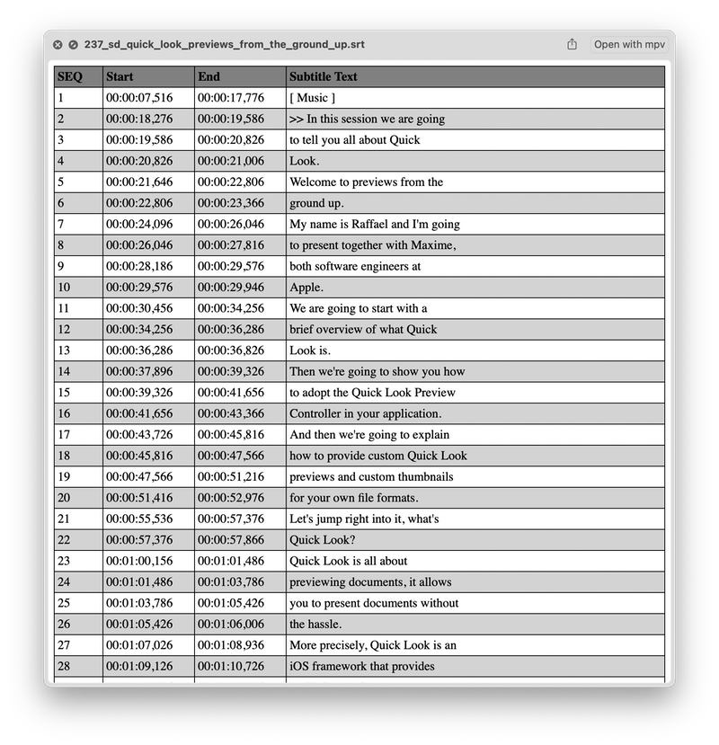
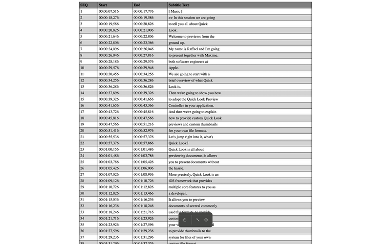
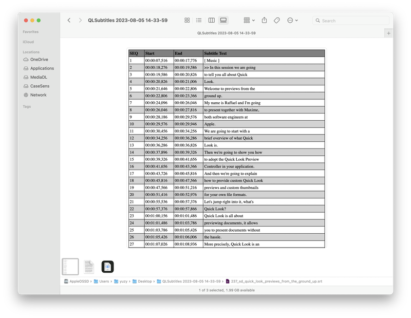
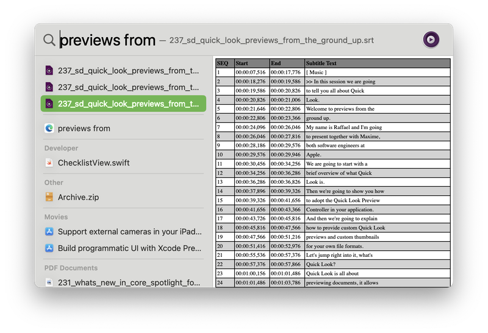

# QLSubtitles
A macOS app providing Quick Look preview for subtitle files such as `.srt`, `.vtt` or `.ass` files

## Notes
- Inspired by [tattali/QLAddict](https://github.com/tattali/QLAddict)
- Doesn't support preview of `.vtt` or `.ass` files yet
- Install & run:
    1. Fisrt time you run this app, please "Allow" it to run on system `"Security & Privacy"` preference panel
    1. Activate "Quick Look Subtitles" or "Preview Subtitles" on system `"Extensions"` preference panel
## Screenshots
- Quick Look in Finder app (press Space bar)

- Fullscreen Quick Look window

- Galary view of Finder app (press ⌘ + 4)

- Spotlight search result preview

