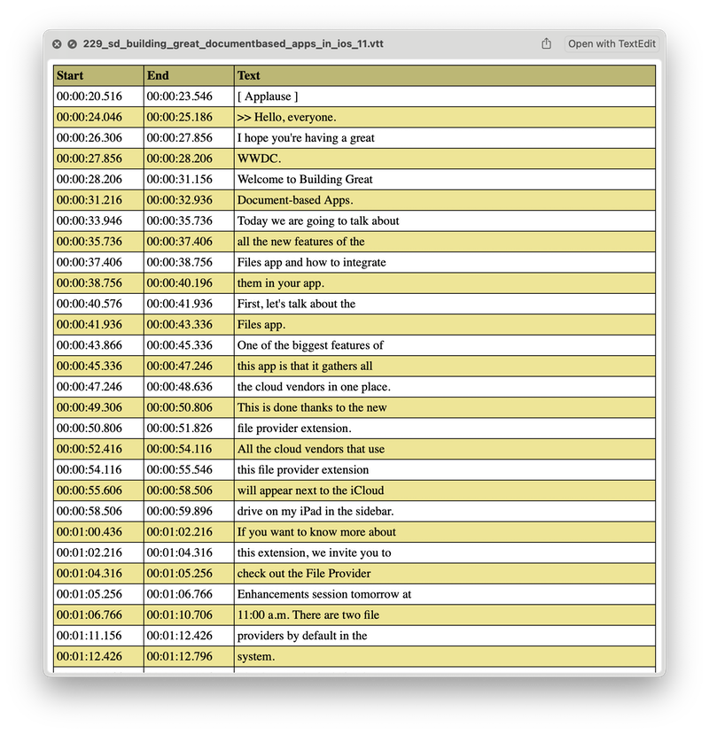

# QLSubtitles
A macOS app providing Quick Look preview for subtitle files such as `.srt`, `.vtt` or `.ass` files

## Notes
- Inspired by [tattali/QLAddict](https://github.com/tattali/QLAddict)
- `STYLE` defined in `.vtt` file is ignored
- `Script Info` in `.ass` file is not displayed. `V4+ Styles` info is disgarded, so do Style Override Codes in subtile text lines
- Install & run:
    1. Fisrt time you run this app, please "Allow" it to run on system `"Security & Privacy"` preference panel
    1. Activate "Quick Look Subtitles" or "Preview Subtitles" on system `"Extensions"` preference panel
## Dependencies
- [dagronf/SwiftSubtitles](https://github.com/dagronf/SwiftSubtitles), parsing .vtt files
## Screenshots
- Quick Look in Finder app (press Space bar)

- Preview WebVTT file

- Fullscreen Quick Look window

- Galary view of Finder app (press ⌘ + 4)

- Spotlight search result preview

